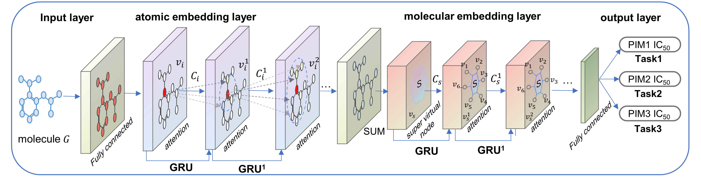

# AFP-MTRM : Prediction of the Activity of PIMs Inhibitors with Graph Attention Mechanism

This repository contains our implementation of [Prediction of the Activity of PIMs Inhibitors with Graph Attention Mechanism](https://doi.org/10.1007/s11030-024-11060-y) (AFP-MTRM). 

If you find this project useful, please cite our paper:

Wang ZX, Sun LL, Chang Yu, Yang F, Jiang K. A Multitask Interpretable Model with Graph Attention Mechanism for Activity Prediction of Low-Data PIM Inhibitors. Molecular Diversity. 2024

# Acknowledgements

We thank the authors of [Pushing the Boundaries of Molecular Representation for Drug Discovery with the Graph Attention Mechanism](https://doi.org/10.1021/acs.jmedchem.9b00959) and [A multitask GNN-based interpretable model for discovery of selective JAK inhibitors](https://doi.org/10.1186/s13321-022-00593-9) for releasing their codes. The code in this repository is based on their source code release ([link1](https://github.com/OpenDrugAI/AttentiveFP)) and ([link2](https://github.com/Yimeng-Wang/JAK-MTATFP)). If you find this code useful, please consider citing their work.

# Data Collection

The data used for model training and evaluation are sourced from the [ChEMBL](https://www.ebi.ac.uk/chembl/) database. The database provides detailed information on chemical structures, biological activities, and associated targets. It offers a wealth of data on the interactions between small molecules and biological targets such as proteins, enzymes, and receptors. This information is crucial for understanding the mechanism of action of drugs and for developing new therapeutic agents. In the application scenario of this project, you can collect inhibitor data for target targets in the CHEMBL database. This will include compound IDs, SMILES, activity data, test methods, etc.

# Data Cleaning

After the previous step, you can obtain a CSV file containing important information about inhibitors.Next, you should further clean the data. This includes deleting invalid data and handling duplicate data, etc.Since the activity label used in this project is the specific value of the inhibitor, and some inhibitors have multiple activity data. In order to obtain more reliable activity data, appropriate rules need to be established to process the activity data of these inhibitors.The following are the rules we have established:

- Retain compounds with a single IC50 value. 
- For compounds with multiple IC50 values where the maximum is less than five times the minimum, retain the averaged IC50 value.
- Delete compounds with multiple IC50 values where the maximum is five times or more than the minimum. 

To preprocess you datasets please go to `data processing` directory and run `Data_Cleaning.ipynb`.

In addition, to ensure the stability of the data used in model training and evaluation, we converted the IC50 (M) values of compounds into pIC50 values.

$$
pIC_{50}=-\log_{10}(IC_{50})
$$

# Normalization

Deep learning models usually require a unified data input format to process molecular data. SMILES provides a standardized string representation, making it convenient for models to read and process a large amount of compound data. In this section, you need to further standardize the SMILES obtained from the [ChEMBL](https://www.ebi.ac.uk/chembl/) database.

To preprocess you datasets please go to `data processing` directory and run `Normalization.ipynb`.

It using the [MolVS](https://molvs.readthedocs.io/en/latest/index.html) tool, which included structure normalization, salt removal, charge neutralization, and duplicate molecule elimination. 

# Dataset Splitting

Before officially starting to train and evaluate the model, you need to divide the processed data into training set, test set and validation set according to a certain proportion. In this project, to mitigate the potential impact of data imbalance, we randomly split the dataset into training, validation, and test sets in a ratio of 8:1:1 ten times and calculate the average results.

To preprocess you datasets please go to `data processing` directory and run `Dataset Splitting.ipynb`.

# Model Training and Evaluation

The AFP-MTRM model is a multitask regression model built upon the [AFP](https://github.com/OpenDrugAI/AttentiveFP). It not only automatically learns local features within molecular structures through an attention mechanism but also flexibly aggregates non-local features, such as intramolecular hydrogen bonds formed by topologically distant atom pairs. 

To train and evaluate your model useing AFP-MTRM, please go to `model` directory and run `model.ipynb`

In addition, to obtain better prediction results, hyperparameter optimization can be performed before formally training the model.